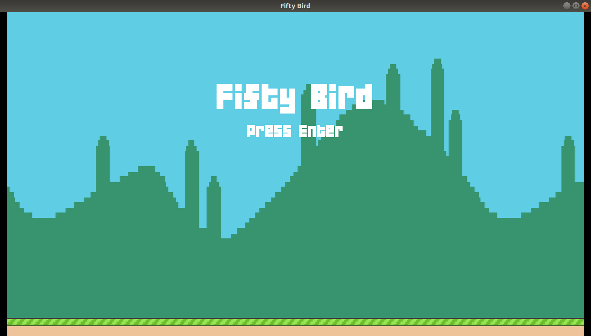
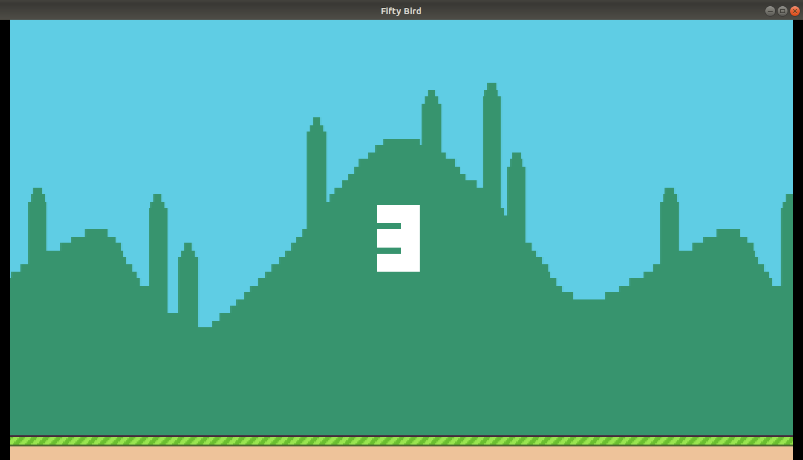
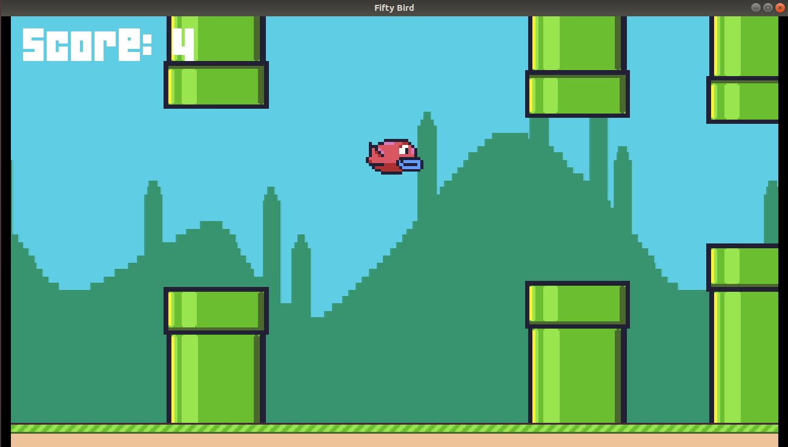
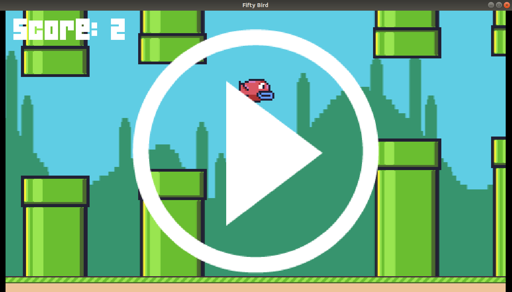
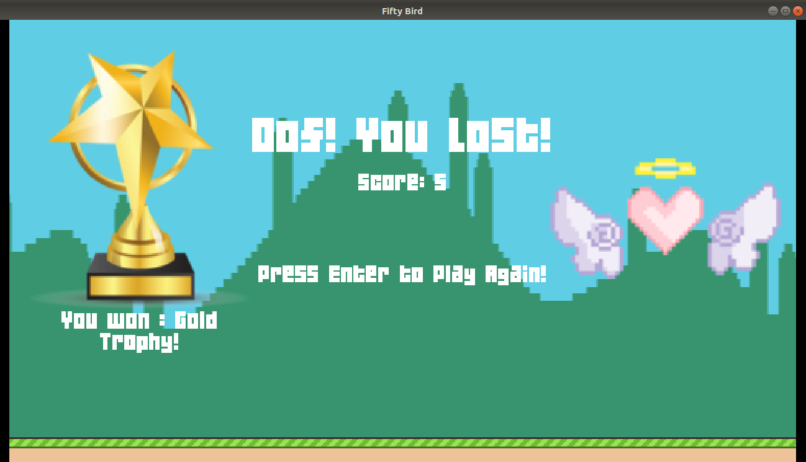
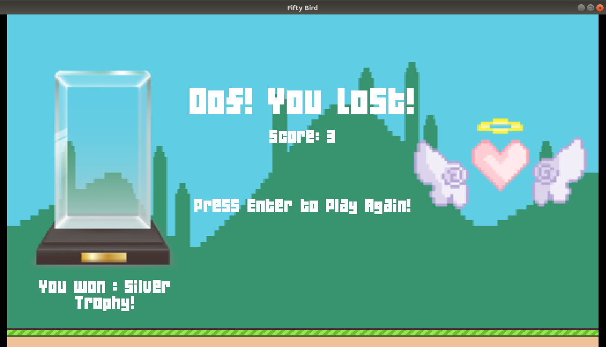
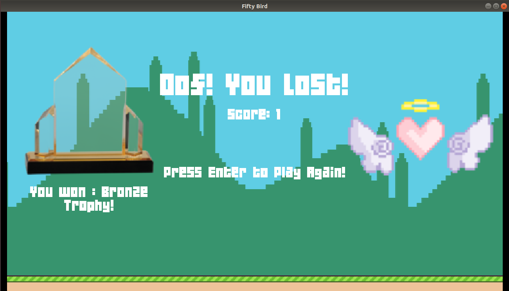

# Fifty Bird

<b>Title Screen State 

 

<b>Countdown State 

 

<b>Play State</b> 
 
Note : You can see randomness in the distance between two consecutive pairs of pipes and the gap between each vertical pair of pipes. 

 

<b>Pause Feature 

 

<b>Score State</b> 
 
Note : For the sake of ease of testing, you need to :
- score >= 5 points to get a GOLD trophy
 
- score >= 3 points to get a SILVER trophy
 
- score >= 1 points to get a BRONZE trophy
 
